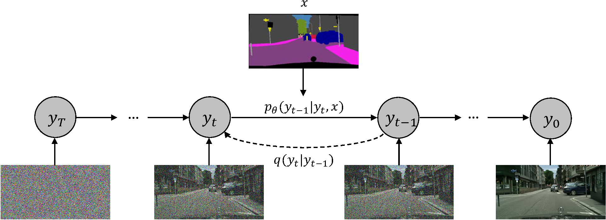
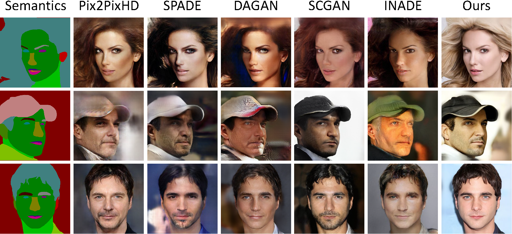
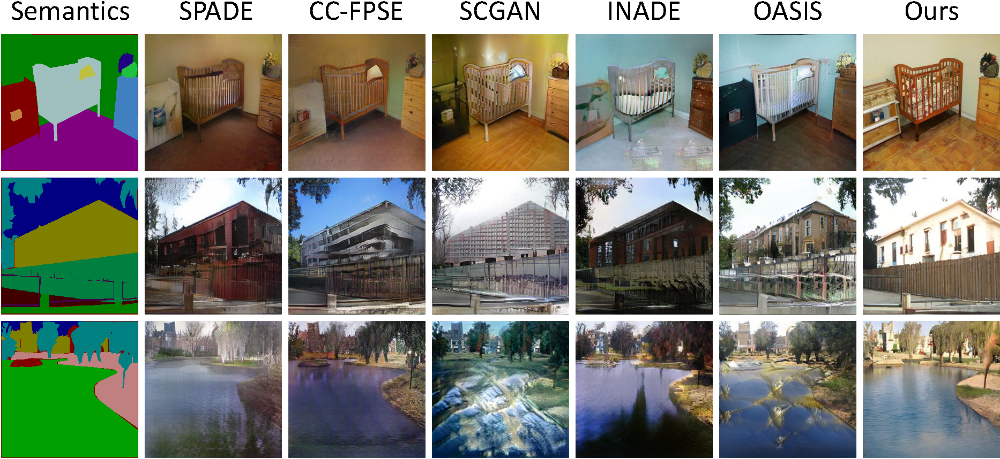
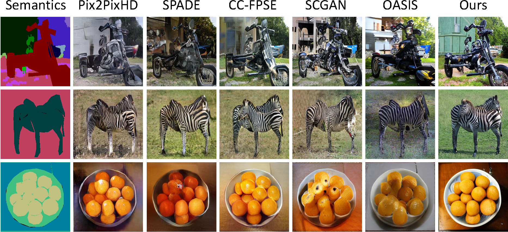

# VAE Semantic Image Synthesis via Diffusion Models (VAE-SDM)

### Todo

- [x] Train the SDE with the CityScape Dataset
  - [x] Implementation of the Cityscape results from the SDM paper
  - [x] Training SDM with the 270X360 @harry
- [ ] Adding the VAE   
  - [ ] Codding in training @harry
  - [ ] Codding in inference @harry
- [ ] Optimize code and other works
  - [ ] Refactor the official code (Change to the pytorch lightning)@harry @HuangChiEn


[//]: # (&nbsp;)

[//]: # ()
[//]: # (  )

[//]: # ()
[//]: # (&nbsp;)

[//]: # ()
[//]: # ()

[//]: # ()
[//]: # (&nbsp;)

[//]: # ()

### [Reference Paper](https://arxiv.org/abs/2207.00050) : Semantic Image Synthesis via Diffusion Models (SDM)

### [Reference Code](https://github.com/WeilunWang/semantic-diffusion-model) : https://github.com/WeilunWang/semantic-diffusion-model

## SDM Example Results
* **Cityscapes:**

<p align='center'>  
  
</p>

* **CelebA:**

<p align='center'>  
  
</p>

* **ADE20K:**

<p align='center'>  
  
</p>

* **COCO-Stuff:**

<p align='center'>  
  
</p>

## Prerequisites
- Linux
- Python 3
- CPU or NVIDIA GPU + CUDA CuDNN
- MPI([openmpi](https://www.open-mpi.org/) Link:[how install](https://blog.csdn.net/liu_feng_zi_/article/details/107429347) better than [mpich](https://www.mpich.org/downloads/) Link:[how install](https://cloud.tencent.com/developer/article/2111003))

## Dataset Preparation
The Cityscapes and ADE20K dataset can be downloaded and prepared following [SPADE](https://github.com/NVlabs/SPADE.git). The CelebAMask-HQ can be downloaded from [CelebAMask-HQ](https://github.com/switchablenorms/CelebAMask-HQ), you need to to integrate the separated annotations into an image file (the format like other datasets, e.g. Cityscapes and ADE20K). 

### NEGCUT Training and Test

- Download the dataset.

- Train the SDM model:
```bash
export OPENAI_LOGDIR='./OUTPUT/Cityscapes-SDM-256CH'
mpiexec -n 4 python image_train.py --data_dir /data1/dataset/Cityscapes --dataset_mode cityscapes --lr 1e-4 --batch_size 4 --attention_resolutions 32,16,8 --diffusion_steps 1000 \
                                   --image_size 256 --learn_sigma True --noise_schedule linear --num_channels 256 --num_head_channels 64 --num_res_blocks 2  \
                                   --resblock_updown True --use_fp16 True --use_scale_shift_norm True --use_checkpoint True --num_classes 35 \
	                           --class_cond True --no_instance False
```

- Fine-tune the SDM model:
```bash
export OPENAI_LOGDIR='../OUTPUT/Cityscapes-SDM-256CH-10epoch-FINETUNE'
mpiexec --allow-run-as-root -np 4 python ../image_train.py --data_dir /data1/dataset/Cityscapes --dataset_mode cityscapes --lr 2e-5 --batch_size 4 --attention_resolutions 32,16,8 --diffusion_steps 1000 --image_size 256 --learn_sigma True \
	     --noise_schedule linear --num_channels 256 --num_head_channels 64 --num_res_blocks 2 --resblock_updown True --use_fp16 True --use_scale_shift_norm True --use_checkpoint True --num_classes 34 \
	     --class_cond True --no_instance False --drop_rate 0.2 --resume_checkpoint ../OUTPUT/Cityscapes-SDM-256CH-10epoch/model.pt --training_step 2000
```

- Test the SDM model:
```bash
export OPENAI_LOGDIR='../OUTPUT/Cityscapes360-SDM-256CH-12kstep-TEST'
mpiexec --allow-run-as-root -np 4 python ../image_sample.py --data_dir /data1/dataset/Cityscapes --dataset_mode cityscapes --attention_resolutions 32,16,8 --diffusion_steps 1000 --image_size 360 --learn_sigma True \
       --noise_schedule linear --num_channels 256 --num_head_channels 64 --num_res_blocks 2 --resblock_updown True --use_fp16 True --use_scale_shift_norm True --num_classes 34 \
       --class_cond True --no_instance False --batch_size 4 --num_samples 8 --model_path ../OUTPUT/Cityscapes360-SDM-256CH-500epoch/model012000.pt --results_path ../RESULTS/Cityscapes360-SDM-256CH-12kstep --s 1.5

```

Please refer to the 'scripts/cityscap.sh' for more details.

### Apply a pre-trained NEGCUT model and evaluate

#### Pretrained Models (to be updated)
|Dataset       | Download link                                                                                                                                                                                            |
|:-------------|:---------------------------------------------------------------------------------------------------------------------------------------------------------------------------------------------------------|
|Cityscapes| [Checkpoint](http://140.115.53.100:1118/sharing/tyD0tSSyT) \| [Visual results](https://drive.google.com/file/d/1TbLGCFJqRI4E8pFZJoHmj8MgDbwtjzhP/view?usp=sharing)                                       |
|ADE20K| [Checkpoint](https://drive.google.com/file/d/1O8Avsvfc8rP9LIt5tkJxowMTpi1nYiik/view?usp=sharing) \| [Visual results](https://drive.google.com/file/d/1NIXmrlBHqgyMHAoLBlmU8YELmL8Ij4kV/view?usp=sharing) |
|CelebAMask-HQ | [Checkpoint](https://drive.google.com/file/d/1iwpruJ5HMHdAA1tuNR8dHkcjGtxzSFV_/view?usp=sharing) \| [Visual results](https://drive.google.com/file/d/1NDfU905iJINu4raoj4JdMOiHP8rTXr_M/view?usp=sharing) |
|COCO-Stuff | [Checkpoint](https://drive.google.com/file/d/17XhegAk8V5W3YiFpHMBUn0LED-n7B44Y/view?usp=sharing) \| [Visual results](https://drive.google.com/file/d/1ZluvN9spJF8jlXlSQ98ekWTmHrzwYCqo/view?usp=sharing) |

- To evaluate the model (e.g., ADE20K), first generate the test results:
```bash
mpiexec -n 8 python image_sample.py --data_dir ./data/ade20k --dataset_mode ade20k --attention_resolutions 32,16,8 --diffusion_steps 1000 \
                                    --image_size 256 --learn_sigma True --noise_schedule linear --num_channels 256 --num_head_channels 64 \ 
                                    --num_res_blocks 2 --resblock_updown True --use_fp16 True --use_scale_shift_norm True --num_classes 151 \
                                    --class_cond True --no_instance True --batch_size 2 --num_samples 2000 --s 1.5 \
                                    --model_path OUTPUT/ADE20K-SDM-256CH-FINETUNE/ema_0.9999_best.pt --results_path RESULTS/ADE20K-SDM-256CH
```

- To calucate FID metric, you should update "path1" and "path2" in "evaluations/test_with_FID.py" and run:
```bash
python evaluations/test_with_FID.py
```

- To calcuate LPIPS, you should evaluate the model for 10 times and run:
```bash
python evaluations/lpips.py GENERATED_IMAGES_DIR
```

### Acknowledge
Our code is developed based on [guided-diffusion](https://github.com/openai/guided-diffusion). We also thank "test_with_FID.py" in [OASIS](https://github.com/boschresearch/OASIS) for FID computation, "lpips.py" in [stargan-v2](https://github.com/clovaai/stargan-v2) for LPIPS computation.

